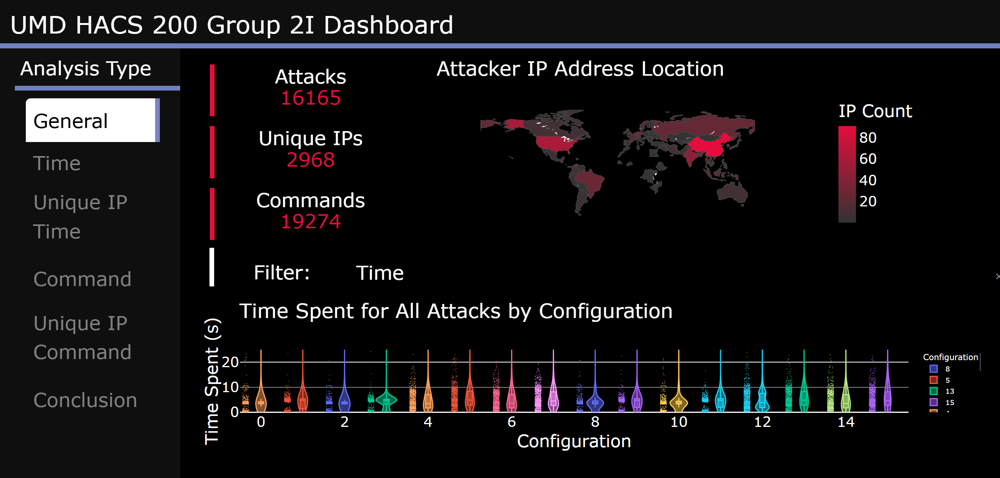
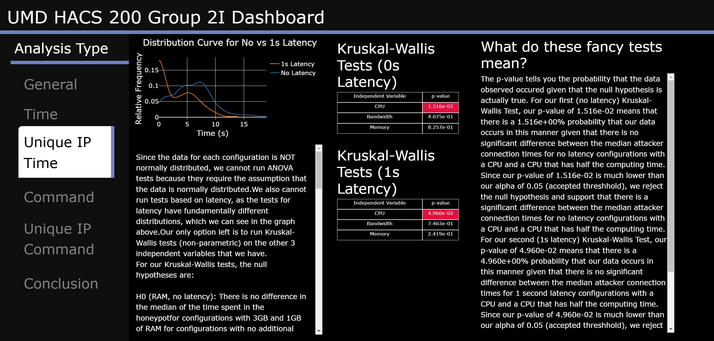

This project is a plotly/dash app for a live dashboard for a cybsersecurity research project with honeypots.

The report is at the bottom of this page.

It connects to live data (obviously only from specific IPs, sorry hackers).

See app.py for the app.

See final report below.

